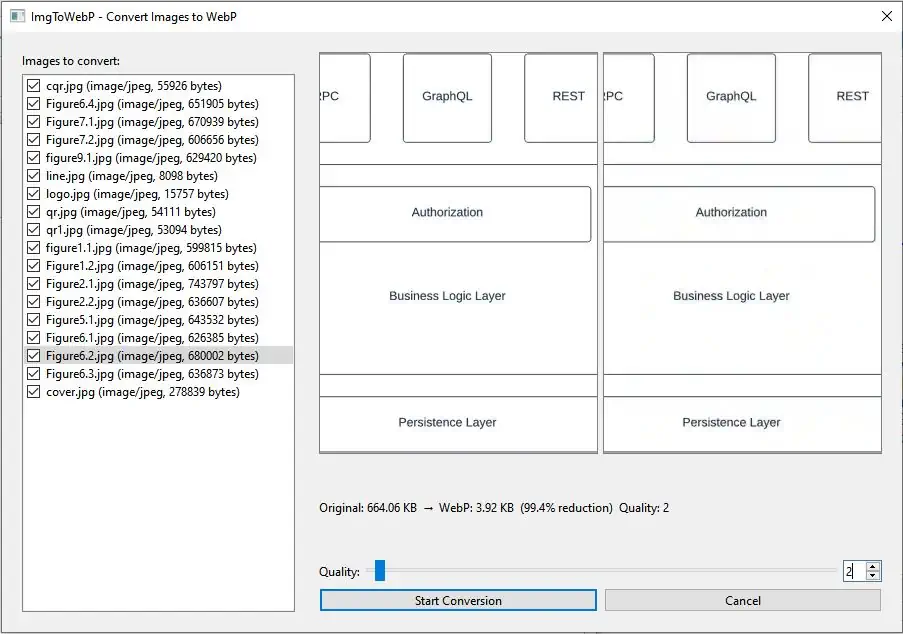

# Little Sigil Plugins

> A collection of handy [Sigil](https://sigil-ebook.com/) plugins almostly crafted by llm.  
> (个人制作) 一些实用的 Sigil 插件 (for epub), 主要是 LLM 帮手的。

## 📦 What’s Inside ｜ 包含哪些插件

| Plugin ｜ 插件 | Description ｜ 描述 | Supported Sigil |
|---------------|---------------------|------------------|
| **[WebpCompressor](WebpCompressor/)** | Convert images in EPUB to WebP with adjustable quality. Preview file size & clarity before applying.   (图片压缩) 将 EPUB 内图片批量转换为 WebP，可调质量，实时预览压缩效果。 | Sigil ≥2.0 (PySide6) |
| **[RemoveDeadImages](RemoveDeadImages/)** | 移除所有 已经删除原图的 \ 元素 | 不限制 |
| **[getOfflineImages](getOfflineImages/)** | 下载在线访问之 外链图片，转离线版， \ to \ 元素内容  | Sigil ≥2.0 (PySide6) |
| **[t2s](t2s/)** | 繁体 <==> 简体互转 （通过 [opencc-python](https://github.com/yichen0831/opencc-python) 实现）  | Sigil ≥2.0 (PySide6) |

---

#### 备注：

- t2s 用到的 opencc-python 版本是 0.1.7，为 zip 格式（原库文件），打包插件前 先解压为 opencc/ 子目录
- getOfflineImages 操作的 epub 文件，可能有其他格式问题，仔细确认后 再进行转换，全部执行前 先单张测试

## 🖼️ Preview ｜ 效果预览

**WebpCompressor** – interactive preview and conversion dialog:  
图片压缩插件的 操作界面

## 🔧 Background: Sigil Plugin Changes ｜ 背景知识

Sigil’s plugin system has evolved through major Qt/Python binding transitions:
 主要：sigil 自从 2.0.0 逐渐转为 PySide6 （之前是 Qt5）

| Sigil Version | Qt | Python | Plugin Binding | Notes |
|---------------|-----|--------|----------------|-------|
| 1.8.0 | Qt 5.12 | 3.9.9 | **PyQt5** | Last stable Qt5, Windows 7 supported |
| 1.9.x | Qt5 (Qt6 optional) | 3.9.9+ | PyQt5 + PySide6 preview | Dual-track builds |
| 2.0.0+ | **Qt 6.5** | **3.11.3** | **PySide6** | PyQt removed; Win10+ required |

- Plugins for Sigil 2.0+ **must** use `PySide6` (or `tkinter`).  
- Sigil 2.0 及以上版本的插件必须使用 `PySide6`（或 `tkinter`）。  
- All plugins in this repo are written with **PySide6** (compatible back to Sigil 1.9 if Qt6 build is used, but primarily tested on Sigil 2.x).  
  本仓库所有插件均采用 **PySide6**（若使用 Sigil 1.9 的 Qt6 构建也可兼容，但主要在 Sigil 2.x 下测试）。

See the [Sigil Plugin](https://github.com/Sigil-Ebook/Sigil/) for the full API.

## 📁 Repository Structure ｜ 仓库结构

- **`/PluginName/`** – source code of each plugin (`.py`, `.xml`, optional icon `.png`).  
  每个插件的源代码（`.py`、`.xml`、可选图标 `.png`）。  
- **`/assets/`** – images, screenshots, etc.  
  图片、截图等资源。

## 🚀 How to Install ｜ 安装方法

1. Download the plugin folder (or zip it yourself).  
   下载插件文件夹（或自行打包 zip）。  
2. In Sigil: **Plugins → Manage Plugins → Add Plugin** and select the **.zip** file.  
   在 Sigil 中：插件 → 管理插件 → 添加插件，选择对应的 .zip 文件。  
3. (Alternative) Zip the plugin folder and use it directly.  
   （替代方案）将插件文件夹压缩为 zip，直接通过 Sigil 安装。

> 🧩 The repository does **not** contain pre‑built .zip files. Use GitHub Releases for packaged downloads, or zip the folder yourself.  
> 仓库内不包含预打包的 .zip 文件。可通过 GitHub Releases 获取打包版本，或自行压缩文件夹。

## 📝 Note for Plugin Developers ｜ 开发注意事项

- Use `bk` (BookContainer) methods for safe file/path manipulation.  
  使用 `bk` 对象的方法来安全操作文件和路径。  
- Preserve `<?xml?>` declaration and `<!DOCTYPE>` when editing XHTML (see `ImgToWebP` for example).  
  修改 XHTML 时记得保留 `<?xml?>` 和 `<!DOCTYPE>`（参考 `ImgToWebP` 的实现）。

## 📄 License ｜ 许可

随意使用，只要是在地球上都可以